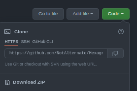

# Hexagn - A simple programming language
This is a collaboration project between
[NotAlternate](https://github.com/NotAlternate/), [GameBuilder202](https://github.com/GameBuilder202/)

## Index
- [About](#about)
- [Feature status](#features-status)
- [Installation](#installation)
- - [MacOS](#macos)
- - [Linux](#linux)
- [Resources](#resources)

## About

Hexagn is designed to be a simple language that is compiled to [URCL](#urcl)

The syntax of Hexagn is designed to be simple so anyone could learn and understand the syntax easily without any troubles.
It is a statically typed language.

The URCL code that Hexagn files are compiled to use stack-based allocations for return values and arguments, which means
that the user can access function arguments using the stack pointer, and set/get return values using push and pop respectively.

[Website for Hexagn](https://notalternate.github.io/hexagn/home.html)<br>
[Documentation](https://notalternate.github.io/hexagn/documentation/main.html)

## Features status

- [ ] Compiled to URCL
- [ ] Built-in URCL emulator

<i>These features can take a while to be done, please be patient :)</i>

# Installation

## Requirements

- G++ (or Clang++ on MacOS)
- Make

## Windows

<i>Installation script for windows hasn't been made yet, please be patient :)</i>

## MacOS

To install the required package, run the following commands depending on your package manager

### Homebrew

```bash
brew update
brew install llvm         # Clang++
```

### MacPorts

```bash
sudo port selfupdate
sudo port install gcc11   # GCC
```

After installing the required packages, clone this repository:
### CLI:
```bash
git clone https://github.com/NotAlternate/Hexagn
```
### Via website:
<br>



Click on "Download ZIP" and then extract the zip.
### Via link:
[Link to copy repository](https://github.com/NotAlternate/Hexagn.git)

After cloning the repository, go to the directory by using <b>cd [directory]</b> or access it via your file manager and opening in the terminal. Run this command when you are in the directory:

```bash
make CXX=clang++   # Run this only if you installed using homebrew
make   # Run this only if you installed using macports
```

## Linux

To install the required packages, run

### APT - Debian, Ubuntu, Kali, etc

```bash
sudo apt upgrade
sudo apt-get install g++    # G++ (if it is not pre-installed)
```

### DNF - Fedora, RHEL, CentOS, OpenSUSE, etc

```bash
sudo dnf upgrade
sudo dnf install gcc-c++   # G++ (if it is not pre-installed)
```

### YUM - Fedora, RHEL, CentOS, OpenSUSE, etc

```bash
sudo yum upgrade
sudo yum install gcc-c++   # G++ (if it is not pre-installed)
```

### PACMAN - Arch, Manjaro, etc

```bash
sudo pacman -Syu
sudo pacman -Sy g++       # G++ (if it is not pre-installed)
```
### APK - Alpine

```bash
sudo apk upgrade
sudo apk add g++
```

After installing the required packages, clone this repository:
### CLI:
```bash
git clone https://github.com/NotAlternate/Hexagn
```
### Via website:
<br>


Click on "Download ZIP" and then extract the zip.
### Via link:
[Link to copy repository](https://github.com/NotAlternate/Hexagn.git)

After cloning the repository, go to the directory by using <b>cd [directory]</b> or access it via your file manager and opening in the terminal. Run this command when you are in the directory:

```bash
make
```

## Verifying installation

If you did the process correctly, Hexagn should now be installed, check with

```bash
hexagn --version
```

# Resources

Resources used for the development of this programming language.

## URCL
URCL stands for Universal Reduced (or Redstone) Computer Language,
made to be compiled to machine code for Minecraft Redstone Computers.

It was created in 2020 by several members of ORE (Open Redstone Engineers, a Minecraft Server)
after a discussion on a standard ISA to help bridge between multiple CPU ISAs (Instruction Architectures).

Following its conception, the group worked hard and developed the standard we know currently as URCL
as well as several tools to assist those who wish to use it
such as this [Online URCL Emulator](https://bramotte.github.io/urcl-explorer)

While the initial idea behind URCL was more concrete, today the idea of URCL isn't something the community can put into words as easily.
It serves to bridge the gap between ISAs as well as an intermediate language for higher level language compilers.

[Discord server for URCL](https://discord.gg/Nv8jzWg5j8)